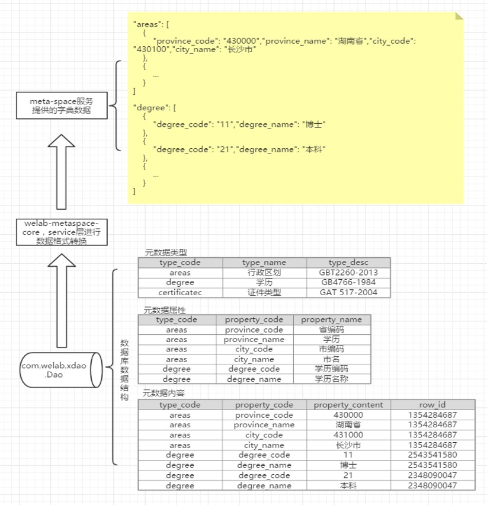
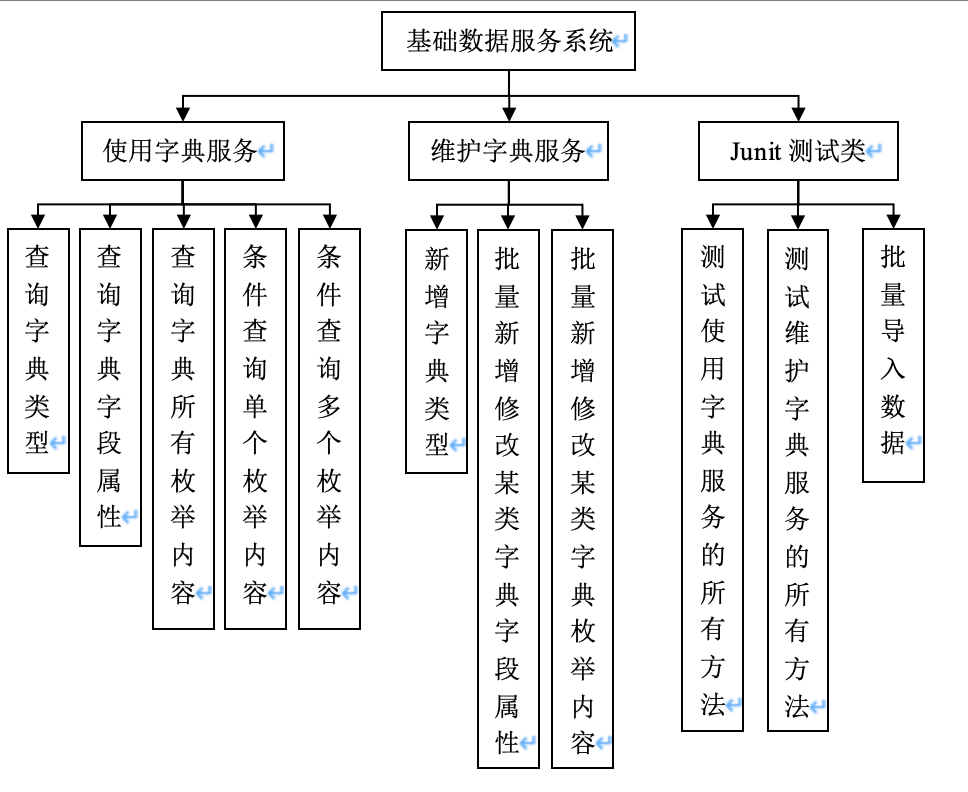

# metaspace

### 介绍
基础数据服务

### 软件架构
jdk 1.8  
maven  
spring boot  
mybatis-plus  
Mysql 5.6  

### 项目设计
1. 背景 
提供统一的地方，加载标准的字典枚举。 
可灵活添加枚举类，枚举字段，和枚举内容，不需要改动代码。 

2. 加载流程 

3. 总体设计方案 
不分应用系统和用户机构，提供统一的，标准化的字典配置。 

4. 模块设计 

5. 参考资料  
字典数据制定标准参考：  
5.1 从业状况	国标 GB-T 2261-4-2003  
5.2 婚姻状况	国标 国标 GB-T 2261-2-2003 
5.3 性别	国标 GBT 2261-1-2003  
5.4 中国国内民族	国标 GBT3304-1991 
5.5 <a href="http://gaokao.chsi.com.cn/gkxx/zszcgd/dnzszc/201706/20170615/1611304456.html" target="_blank">中国高院校	教育部 2017年全国高等学校名单</a>
 
5.6 中国行政区划	国标GBT2260-2017 
5.7 国家和地区 	ISO_3166-1;国标 GBT2659-2000 
5.8 国际币种	ISO_4217 

### 数据库初始化
数据初始化： metaspace\doc\brycepace.sql

### 项目使用

Junit4 测试用例：com.bryce.metaspace  
启动方式：com.bryce.metaspace.MetaspaceApplication.java  
访问地址：
  * 获得字典类型集合  http://localhost:8089/bryce/metaspace/v1/render/getTypes?typeCodes=nations  
  * 查询字典属性 http://localhost:8089/bryce/metaspace/v1/render/getTypePropertys?typeCode=nations  
  * 查询字典所有枚举对象	http://localhost:8089/bryce/metaspace/v1/render/getTypeAllContents?typeCode=nations  

